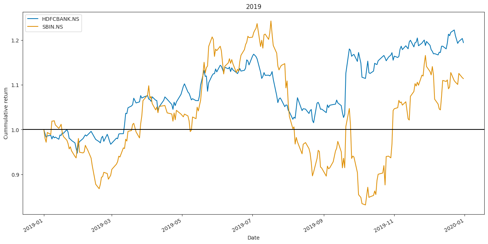
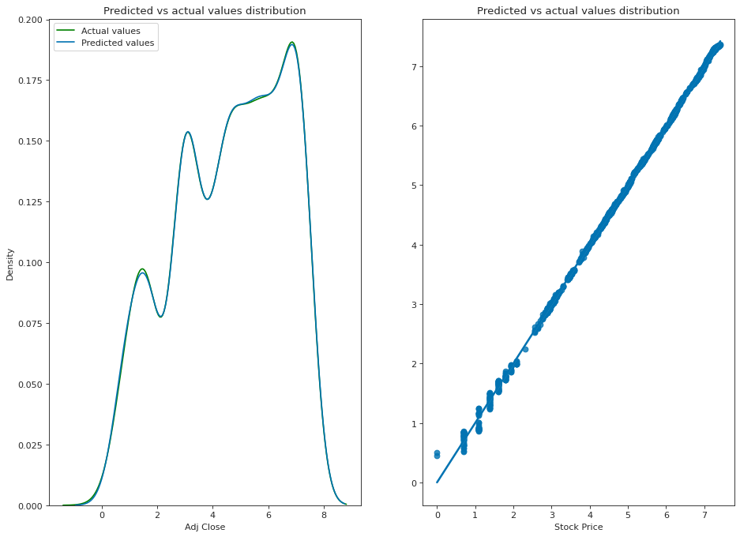

```python
# imports

import numpy as np
import pandas as pd
#from pandas_datareader.data import DataReader
import matplotlib.pyplot as plt
import matplotlib.dates as mdates
from IPython import display
import seaborn as sns
import plotly.graph_objs as go
%matplotlib inline

#import functions
import plotting

from datetime import datetime,date

from sklearn.preprocessing import MinMaxScaler
from sklearn.model_selection import train_test_split
from sklearn.ensemble import RandomForestRegressor
from sklearn.linear_model import LinearRegression
from sklearn.metrics import mean_absolute_error
from keras.models import Sequential
from keras.layers.core import Dense, Activation, Dropout
from keras.metrics import mean_squared_error
# from keras.layers.recurrent import LSTM
from keras.layers import LSTM
import nsepy as ns
import streamlit as st
import nsepy.constants as ns


# Needed to help our plots look cleaner with plotly 
import plotly.graph_objs as go
from plotly.offline import init_notebook_mode, iplot
from plotly import tools
init_notebook_mode(connected=True)

```


<script type="text/javascript">
window.PlotlyConfig = {MathJaxConfig: 'local'};
if (window.MathJax && window.MathJax.Hub && window.MathJax.Hub.Config) {window.MathJax.Hub.Config({SVG: {font: "STIX-Web"}});}
if (typeof require !== 'undefined') {
require.undef("plotly");
requirejs.config({
    paths: {
        'plotly': ['https://cdn.plot.ly/plotly-2.12.1.min']
    }
});
require(['plotly'], function(Plotly) {
    window._Plotly = Plotly;
});
}
</script>


```python
# Download stock data then export as CSV

import yfinance as yfin

tickers = ("HDFCBANK.NS", "SBIN.NS") 

start = "1990-01-01"
end = '2022-12-31'

fin_data = yfin.download(tickers, start, end) #download yahoo finance data for specific dates

fin_data

```

    [*********************100%***********************]  2 of 2 completed
    


<div>
<style scoped>
    .dataframe tbody tr th:only-of-type {
        vertical-align: middle;
    }

    .dataframe tbody tr th {
        vertical-align: top;
    }

    .dataframe thead tr th {
        text-align: left;
    }

    .dataframe thead tr:last-of-type th {
        text-align: right;
    }
</style>
<table border="1" class="dataframe">
  <thead>
    <tr>
      <th></th>
      <th colspan="2" halign="left">Adj Close</th>
      <th colspan="2" halign="left">Close</th>
      <th colspan="2" halign="left">High</th>
      <th colspan="2" halign="left">Low</th>
      <th colspan="2" halign="left">Open</th>
      <th colspan="2" halign="left">Volume</th>
    </tr>
    <tr>
      <th></th>
      <th>HDFCBANK.NS</th>
      <th>SBIN.NS</th>
      <th>HDFCBANK.NS</th>
      <th>SBIN.NS</th>
      <th>HDFCBANK.NS</th>
      <th>SBIN.NS</th>
      <th>HDFCBANK.NS</th>
      <th>SBIN.NS</th>
      <th>HDFCBANK.NS</th>
      <th>SBIN.NS</th>
      <th>HDFCBANK.NS</th>
      <th>SBIN.NS</th>
    </tr>
    <tr>
      <th>Date</th>
      <th></th>
      <th></th>
      <th></th>
      <th></th>
      <th></th>
      <th></th>
      <th></th>
      <th></th>
      <th></th>
      <th></th>
      <th></th>
      <th></th>
    </tr>
  </thead>
  <tbody>
    <tr>
      <th>1996-01-01</th>
      <td>2.389958</td>
      <td>12.651091</td>
      <td>2.980000</td>
      <td>18.823240</td>
      <td>3.030000</td>
      <td>18.978922</td>
      <td>2.925000</td>
      <td>18.540184</td>
      <td>3.030000</td>
      <td>18.691147</td>
      <td>350000</td>
      <td>43733533.0</td>
    </tr>
    <tr>
      <th>1996-01-02</th>
      <td>2.385947</td>
      <td>12.248412</td>
      <td>2.975000</td>
      <td>18.224106</td>
      <td>3.025000</td>
      <td>18.964767</td>
      <td>2.950000</td>
      <td>17.738192</td>
      <td>2.980000</td>
      <td>18.894005</td>
      <td>412000</td>
      <td>56167280.0</td>
    </tr>
    <tr>
      <th>1996-01-03</th>
      <td>2.393967</td>
      <td>11.921826</td>
      <td>2.985000</td>
      <td>17.738192</td>
      <td>2.995000</td>
      <td>18.568489</td>
      <td>2.950000</td>
      <td>17.643839</td>
      <td>2.975000</td>
      <td>18.327892</td>
      <td>284000</td>
      <td>68296318.0</td>
    </tr>
    <tr>
      <th>1996-01-04</th>
      <td>2.377928</td>
      <td>11.880610</td>
      <td>2.965000</td>
      <td>17.676863</td>
      <td>2.980000</td>
      <td>17.832542</td>
      <td>2.940000</td>
      <td>17.223972</td>
      <td>2.985000</td>
      <td>17.502312</td>
      <td>282000</td>
      <td>86073880.0</td>
    </tr>
    <tr>
      <th>1996-01-05</th>
      <td>2.373917</td>
      <td>11.814024</td>
      <td>2.960000</td>
      <td>17.577793</td>
      <td>2.980000</td>
      <td>17.785366</td>
      <td>2.950000</td>
      <td>17.459852</td>
      <td>2.965000</td>
      <td>17.738192</td>
      <td>189000</td>
      <td>76613039.0</td>
    </tr>
    <tr>
      <th>...</th>
      <td>...</td>
      <td>...</td>
      <td>...</td>
      <td>...</td>
      <td>...</td>
      <td>...</td>
      <td>...</td>
      <td>...</td>
      <td>...</td>
      <td>...</td>
      <td>...</td>
      <td>...</td>
    </tr>
    <tr>
      <th>2022-12-26</th>
      <td>1629.449951</td>
      <td>597.099976</td>
      <td>1629.449951</td>
      <td>597.099976</td>
      <td>1639.000000</td>
      <td>601.700012</td>
      <td>1590.000000</td>
      <td>570.700012</td>
      <td>1599.500000</td>
      <td>574.000000</td>
      <td>4953661</td>
      <td>13201587.0</td>
    </tr>
    <tr>
      <th>2022-12-27</th>
      <td>1631.099976</td>
      <td>601.900024</td>
      <td>1631.099976</td>
      <td>601.900024</td>
      <td>1635.949951</td>
      <td>603.099976</td>
      <td>1613.500000</td>
      <td>593.299988</td>
      <td>1633.000000</td>
      <td>600.400024</td>
      <td>3963386</td>
      <td>9638618.0</td>
    </tr>
    <tr>
      <th>2022-12-28</th>
      <td>1629.800049</td>
      <td>601.049988</td>
      <td>1629.800049</td>
      <td>601.049988</td>
      <td>1633.000000</td>
      <td>607.000000</td>
      <td>1623.099976</td>
      <td>598.549988</td>
      <td>1623.099976</td>
      <td>600.900024</td>
      <td>4345935</td>
      <td>7988631.0</td>
    </tr>
    <tr>
      <th>2022-12-29</th>
      <td>1641.300049</td>
      <td>611.799988</td>
      <td>1641.300049</td>
      <td>611.799988</td>
      <td>1643.500000</td>
      <td>618.000000</td>
      <td>1611.000000</td>
      <td>597.150024</td>
      <td>1620.099976</td>
      <td>600.000000</td>
      <td>5506448</td>
      <td>20130392.0</td>
    </tr>
    <tr>
      <th>2022-12-30</th>
      <td>1628.150024</td>
      <td>613.700012</td>
      <td>1628.150024</td>
      <td>613.700012</td>
      <td>1645.000000</td>
      <td>620.549988</td>
      <td>1620.000000</td>
      <td>611.349976</td>
      <td>1645.000000</td>
      <td>615.250000</td>
      <td>3561320</td>
      <td>13052895.0</td>
    </tr>
  </tbody>
</table>
<p>6793 rows × 12 columns</p>
</div>


```python
fin_data.to_csv('./data/spp5_nse_fin_data2.csv') #convert data to csv
```


```python
#check the dimensions of the data
fin_data.shape
```


    (6793, 12)


```python
#view the first 5 rows of the data
fin_data.head()#view the first 5 rows of the data
fin_data.head()
```


<div>
<style scoped>
    .dataframe tbody tr th:only-of-type {
        vertical-align: middle;
    }

    .dataframe tbody tr th {
        vertical-align: top;
    }

    .dataframe thead tr th {
        text-align: left;
    }

    .dataframe thead tr:last-of-type th {
        text-align: right;
    }
</style>
<table border="1" class="dataframe">
  <thead>
    <tr>
      <th></th>
      <th colspan="2" halign="left">Adj Close</th>
      <th colspan="2" halign="left">Close</th>
      <th colspan="2" halign="left">High</th>
      <th colspan="2" halign="left">Low</th>
      <th colspan="2" halign="left">Open</th>
      <th colspan="2" halign="left">Volume</th>
    </tr>
    <tr>
      <th></th>
      <th>HDFCBANK.NS</th>
      <th>SBIN.NS</th>
      <th>HDFCBANK.NS</th>
      <th>SBIN.NS</th>
      <th>HDFCBANK.NS</th>
      <th>SBIN.NS</th>
      <th>HDFCBANK.NS</th>
      <th>SBIN.NS</th>
      <th>HDFCBANK.NS</th>
      <th>SBIN.NS</th>
      <th>HDFCBANK.NS</th>
      <th>SBIN.NS</th>
    </tr>
    <tr>
      <th>Date</th>
      <th></th>
      <th></th>
      <th></th>
      <th></th>
      <th></th>
      <th></th>
      <th></th>
      <th></th>
      <th></th>
      <th></th>
      <th></th>
      <th></th>
    </tr>
  </thead>
  <tbody>
    <tr>
      <th>1996-01-01</th>
      <td>2.389958</td>
      <td>12.651091</td>
      <td>2.980</td>
      <td>18.823240</td>
      <td>3.030</td>
      <td>18.978922</td>
      <td>2.925</td>
      <td>18.540184</td>
      <td>3.030</td>
      <td>18.691147</td>
      <td>350000</td>
      <td>43733533.0</td>
    </tr>
    <tr>
      <th>1996-01-02</th>
      <td>2.385947</td>
      <td>12.248412</td>
      <td>2.975</td>
      <td>18.224106</td>
      <td>3.025</td>
      <td>18.964767</td>
      <td>2.950</td>
      <td>17.738192</td>
      <td>2.980</td>
      <td>18.894005</td>
      <td>412000</td>
      <td>56167280.0</td>
    </tr>
    <tr>
      <th>1996-01-03</th>
      <td>2.393967</td>
      <td>11.921826</td>
      <td>2.985</td>
      <td>17.738192</td>
      <td>2.995</td>
      <td>18.568489</td>
      <td>2.950</td>
      <td>17.643839</td>
      <td>2.975</td>
      <td>18.327892</td>
      <td>284000</td>
      <td>68296318.0</td>
    </tr>
    <tr>
      <th>1996-01-04</th>
      <td>2.377928</td>
      <td>11.880610</td>
      <td>2.965</td>
      <td>17.676863</td>
      <td>2.980</td>
      <td>17.832542</td>
      <td>2.940</td>
      <td>17.223972</td>
      <td>2.985</td>
      <td>17.502312</td>
      <td>282000</td>
      <td>86073880.0</td>
    </tr>
    <tr>
      <th>1996-01-05</th>
      <td>2.373917</td>
      <td>11.814024</td>
      <td>2.960</td>
      <td>17.577793</td>
      <td>2.980</td>
      <td>17.785366</td>
      <td>2.950</td>
      <td>17.459852</td>
      <td>2.965</td>
      <td>17.738192</td>
      <td>189000</td>
      <td>76613039.0</td>
    </tr>
  </tbody>
</table>
</div>


```python
#view the last 5 values of the data
fin_data.tail()
```


<div>
<style scoped>
    .dataframe tbody tr th:only-of-type {
        vertical-align: middle;
    }

    .dataframe tbody tr th {
        vertical-align: top;
    }

    .dataframe thead tr th {
        text-align: left;
    }

    .dataframe thead tr:last-of-type th {
        text-align: right;
    }
</style>
<table border="1" class="dataframe">
  <thead>
    <tr>
      <th></th>
      <th colspan="2" halign="left">Adj Close</th>
      <th colspan="2" halign="left">Close</th>
      <th colspan="2" halign="left">High</th>
      <th colspan="2" halign="left">Low</th>
      <th colspan="2" halign="left">Open</th>
      <th colspan="2" halign="left">Volume</th>
    </tr>
    <tr>
      <th></th>
      <th>HDFCBANK.NS</th>
      <th>SBIN.NS</th>
      <th>HDFCBANK.NS</th>
      <th>SBIN.NS</th>
      <th>HDFCBANK.NS</th>
      <th>SBIN.NS</th>
      <th>HDFCBANK.NS</th>
      <th>SBIN.NS</th>
      <th>HDFCBANK.NS</th>
      <th>SBIN.NS</th>
      <th>HDFCBANK.NS</th>
      <th>SBIN.NS</th>
    </tr>
    <tr>
      <th>Date</th>
      <th></th>
      <th></th>
      <th></th>
      <th></th>
      <th></th>
      <th></th>
      <th></th>
      <th></th>
      <th></th>
      <th></th>
      <th></th>
      <th></th>
    </tr>
  </thead>
  <tbody>
    <tr>
      <th>2022-12-26</th>
      <td>1629.449951</td>
      <td>597.099976</td>
      <td>1629.449951</td>
      <td>597.099976</td>
      <td>1639.000000</td>
      <td>601.700012</td>
      <td>1590.000000</td>
      <td>570.700012</td>
      <td>1599.500000</td>
      <td>574.000000</td>
      <td>4953661</td>
      <td>13201587.0</td>
    </tr>
    <tr>
      <th>2022-12-27</th>
      <td>1631.099976</td>
      <td>601.900024</td>
      <td>1631.099976</td>
      <td>601.900024</td>
      <td>1635.949951</td>
      <td>603.099976</td>
      <td>1613.500000</td>
      <td>593.299988</td>
      <td>1633.000000</td>
      <td>600.400024</td>
      <td>3963386</td>
      <td>9638618.0</td>
    </tr>
    <tr>
      <th>2022-12-28</th>
      <td>1629.800049</td>
      <td>601.049988</td>
      <td>1629.800049</td>
      <td>601.049988</td>
      <td>1633.000000</td>
      <td>607.000000</td>
      <td>1623.099976</td>
      <td>598.549988</td>
      <td>1623.099976</td>
      <td>600.900024</td>
      <td>4345935</td>
      <td>7988631.0</td>
    </tr>
    <tr>
      <th>2022-12-29</th>
      <td>1641.300049</td>
      <td>611.799988</td>
      <td>1641.300049</td>
      <td>611.799988</td>
      <td>1643.500000</td>
      <td>618.000000</td>
      <td>1611.000000</td>
      <td>597.150024</td>
      <td>1620.099976</td>
      <td>600.000000</td>
      <td>5506448</td>
      <td>20130392.0</td>
    </tr>
    <tr>
      <th>2022-12-30</th>
      <td>1628.150024</td>
      <td>613.700012</td>
      <td>1628.150024</td>
      <td>613.700012</td>
      <td>1645.000000</td>
      <td>620.549988</td>
      <td>1620.000000</td>
      <td>611.349976</td>
      <td>1645.000000</td>
      <td>615.250000</td>
      <td>3561320</td>
      <td>13052895.0</td>
    </tr>
  </tbody>
</table>
</div>


```python
#check if there are missing values for each type of stock
fin_data.isnull().sum()
```


    Adj Close  HDFCBANK.NS    0
               SBIN.NS        2
    Close      HDFCBANK.NS    0
               SBIN.NS        2
    High       HDFCBANK.NS    0
               SBIN.NS        2
    Low        HDFCBANK.NS    0
               SBIN.NS        2
    Open       HDFCBANK.NS    0
               SBIN.NS        2
    Volume     HDFCBANK.NS    0
               SBIN.NS        2
    dtype: int64


```python
# handing missing values
fin_data.fillna(method='ffill', inplace = True) # use front fill method
fin_data.fillna(method='bfill', inplace = True) # use back fill method
#check to see if there are still any missing values
fin_data.isnull().sum()
```


    Adj Close  HDFCBANK.NS    0
               SBIN.NS        0
    Close      HDFCBANK.NS    0
               SBIN.NS        0
    High       HDFCBANK.NS    0
               SBIN.NS        0
    Low        HDFCBANK.NS    0
               SBIN.NS        0
    Open       HDFCBANK.NS    0
               SBIN.NS        0
    Volume     HDFCBANK.NS    0
               SBIN.NS        0
    dtype: int64


```python
#view descriptive statistics of adjusted close process of the stocks
fin_data[['Adj Close']].describe()
```


<div>
<style scoped>
    .dataframe tbody tr th:only-of-type {
        vertical-align: middle;
    }

    .dataframe tbody tr th {
        vertical-align: top;
    }

    .dataframe thead tr th {
        text-align: left;
    }
</style>
<table border="1" class="dataframe">
  <thead>
    <tr>
      <th></th>
      <th colspan="2" halign="left">Adj Close</th>
    </tr>
    <tr>
      <th></th>
      <th>HDFCBANK.NS</th>
      <th>SBIN.NS</th>
    </tr>
  </thead>
  <tbody>
    <tr>
      <th>count</th>
      <td>6793.000000</td>
      <td>6793.000000</td>
    </tr>
    <tr>
      <th>mean</th>
      <td>363.033678</td>
      <td>152.287667</td>
    </tr>
    <tr>
      <th>std</th>
      <td>463.039529</td>
      <td>133.509359</td>
    </tr>
    <tr>
      <th>min</th>
      <td>1.952868</td>
      <td>9.716629</td>
    </tr>
    <tr>
      <th>25%</th>
      <td>20.548925</td>
      <td>19.724920</td>
    </tr>
    <tr>
      <th>50%</th>
      <td>134.575043</td>
      <td>148.246399</td>
    </tr>
    <tr>
      <th>75%</th>
      <td>519.264160</td>
      <td>242.389175</td>
    </tr>
    <tr>
      <th>max</th>
      <td>1669.291016</td>
      <td>625.500000</td>
    </tr>
  </tbody>
</table>
</div>


```python
# view general info
fin_data.info()
```

    <class 'pandas.core.frame.DataFrame'>
    DatetimeIndex: 6793 entries, 1996-01-01 to 2022-12-30
    Data columns (total 12 columns):
     #   Column                    Non-Null Count  Dtype  
    ---  ------                    --------------  -----  
     0   (Adj Close, HDFCBANK.NS)  6793 non-null   float64
     1   (Adj Close, SBIN.NS)      6793 non-null   float64
     2   (Close, HDFCBANK.NS)      6793 non-null   float64
     3   (Close, SBIN.NS)          6793 non-null   float64
     4   (High, HDFCBANK.NS)       6793 non-null   float64
     5   (High, SBIN.NS)           6793 non-null   float64
     6   (Low, HDFCBANK.NS)        6793 non-null   float64
     7   (Low, SBIN.NS)            6793 non-null   float64
     8   (Open, HDFCBANK.NS)       6793 non-null   float64
     9   (Open, SBIN.NS)           6793 non-null   float64
     10  (Volume, HDFCBANK.NS)     6793 non-null   int64  
     11  (Volume, SBIN.NS)         6793 non-null   float64
    dtypes: float64(11), int64(1)
    memory usage: 689.9 KB
    

##### Focusing on the maximum close feature is important in stock price analysis as it can provide insights into trend analysis, resistance levels, and potential targets for the stock.


```python
# View the maximum close date of stocks
def max_close(df, stocks):
    """This calculates and returns the maximum closing value of a specific stock"""
    return df['Close'][stocks].max()

# Test the function with specific stocks
def test_max():
    """This tests the max_close function"""
    for stock in tickers:
        print("Maximum Closing Value for {} is {}".format(stock, max_close(fin_data, stock)))

test_max() 
```

    Maximum Closing Value for HDFCBANK.NS is 1688.699951171875
    Maximum Closing Value for SBIN.NS is 625.5
    


```python
# calculate the mean volume for the stocks
def mean_vol(stocks,df):
    """ This calculates and returns the minimum volume of a specific stock"""
    return df['Volume'][stocks].mean() # computes and returns the minimum volume of a stock

# test the above function with specific stocks
def test_mean():
    """ This tests the max_close function"""
    for stocks in ["HDFCBANK.NS","SBIN.NS"]:
        print("Mean Volume for {} is {}".format(stocks, mean_vol(stocks,fin_data)))

test_mean()        
```

    Mean Volume for HDFCBANK.NS is 5044739.33225379
    Mean Volume for SBIN.NS is 31878753.824083615
    

### Plotting stock prices


```python
# Plot function for the Adjusted closing value
def plot_adj(df,title,stocks,y=0):
        ax = df['Adj Close'][stocks].plot(title=title, figsize=(10,8), ax=None)
        ax.set_xlabel("Date")
        ax.set_ylabel("Stock Price")
        ax.axhline(y=y,color='black')
        ax.legend(stocks, loc='upper left')
        plt.show()
```


```python
# View the plot of Adjusted close
stocks = ["HDFCBANK.NS", "SBIN.NS"]
plot_adj(fin_data,"Adjusted Close Stock Prices",stocks)
```


    

    


```python

fin_data['Adj Close']['HDFCBANK.NS']
```


    Date
    1996-01-01       2.389958
    1996-01-02       2.385947
    1996-01-03       2.393967
    1996-01-04       2.377928
    1996-01-05       2.373917
                     ...     
    2022-12-26    1629.449951
    2022-12-27    1631.099976
    2022-12-28    1629.800049
    2022-12-29    1641.300049
    2022-12-30    1628.150024
    Name: HDFCBANK.NS, Length: 6793, dtype: float64


```python
fin_data['Adj Close']['SBIN.NS']
```


    Date
    1996-01-01     12.651091
    1996-01-02     12.248412
    1996-01-03     11.921826
    1996-01-04     11.880610
    1996-01-05     11.814024
                     ...    
    2022-12-26    597.099976
    2022-12-27    601.900024
    2022-12-28    601.049988
    2022-12-29    611.799988
    2022-12-30    613.700012
    Name: SBIN.NS, Length: 6793, dtype: float64


```python
fin_data.loc[:, ('Adj Close', ["HDFCBANK.NS", "SBIN.NS"])]

```


<div>
<style scoped>
    .dataframe tbody tr th:only-of-type {
        vertical-align: middle;
    }

    .dataframe tbody tr th {
        vertical-align: top;
    }

    .dataframe thead tr th {
        text-align: left;
    }

    .dataframe thead tr:last-of-type th {
        text-align: right;
    }
</style>
<table border="1" class="dataframe">
  <thead>
    <tr>
      <th></th>
      <th colspan="2" halign="left">Adj Close</th>
    </tr>
    <tr>
      <th></th>
      <th>HDFCBANK.NS</th>
      <th>SBIN.NS</th>
    </tr>
    <tr>
      <th>Date</th>
      <th></th>
      <th></th>
    </tr>
  </thead>
  <tbody>
    <tr>
      <th>1996-01-01</th>
      <td>2.389958</td>
      <td>12.651091</td>
    </tr>
    <tr>
      <th>1996-01-02</th>
      <td>2.385947</td>
      <td>12.248412</td>
    </tr>
    <tr>
      <th>1996-01-03</th>
      <td>2.393967</td>
      <td>11.921826</td>
    </tr>
    <tr>
      <th>1996-01-04</th>
      <td>2.377928</td>
      <td>11.880610</td>
    </tr>
    <tr>
      <th>1996-01-05</th>
      <td>2.373917</td>
      <td>11.814024</td>
    </tr>
    <tr>
      <th>...</th>
      <td>...</td>
      <td>...</td>
    </tr>
    <tr>
      <th>2022-12-26</th>
      <td>1629.449951</td>
      <td>597.099976</td>
    </tr>
    <tr>
      <th>2022-12-27</th>
      <td>1631.099976</td>
      <td>601.900024</td>
    </tr>
    <tr>
      <th>2022-12-28</th>
      <td>1629.800049</td>
      <td>601.049988</td>
    </tr>
    <tr>
      <th>2022-12-29</th>
      <td>1641.300049</td>
      <td>611.799988</td>
    </tr>
    <tr>
      <th>2022-12-30</th>
      <td>1628.150024</td>
      <td>613.700012</td>
    </tr>
  </tbody>
</table>
<p>6793 rows × 2 columns</p>
</div>


```python
fin_data['Adj Close'].loc['2012-01-01':'2022-12-31', ['SBIN.NS', 'HDFCBANK.NS']]

```


<div>
<style scoped>
    .dataframe tbody tr th:only-of-type {
        vertical-align: middle;
    }

    .dataframe tbody tr th {
        vertical-align: top;
    }

    .dataframe thead th {
        text-align: right;
    }
</style>
<table border="1" class="dataframe">
  <thead>
    <tr style="text-align: right;">
      <th></th>
      <th>SBIN.NS</th>
      <th>HDFCBANK.NS</th>
    </tr>
    <tr>
      <th>Date</th>
      <th></th>
      <th></th>
    </tr>
  </thead>
  <tbody>
    <tr>
      <th>2012-01-02</th>
      <td>145.608505</td>
      <td>197.498596</td>
    </tr>
    <tr>
      <th>2012-01-03</th>
      <td>152.586365</td>
      <td>203.189667</td>
    </tr>
    <tr>
      <th>2012-01-04</th>
      <td>151.727539</td>
      <td>205.109818</td>
    </tr>
    <tr>
      <th>2012-01-05</th>
      <td>151.405457</td>
      <td>205.271774</td>
    </tr>
    <tr>
      <th>2012-01-06</th>
      <td>149.643127</td>
      <td>209.736679</td>
    </tr>
    <tr>
      <th>...</th>
      <td>...</td>
      <td>...</td>
    </tr>
    <tr>
      <th>2022-12-26</th>
      <td>597.099976</td>
      <td>1629.449951</td>
    </tr>
    <tr>
      <th>2022-12-27</th>
      <td>601.900024</td>
      <td>1631.099976</td>
    </tr>
    <tr>
      <th>2022-12-28</th>
      <td>601.049988</td>
      <td>1629.800049</td>
    </tr>
    <tr>
      <th>2022-12-29</th>
      <td>611.799988</td>
      <td>1641.300049</td>
    </tr>
    <tr>
      <th>2022-12-30</th>
      <td>613.700012</td>
      <td>1628.150024</td>
    </tr>
  </tbody>
</table>
<p>2713 rows × 2 columns</p>
</div>


```python
# create function to plot data
def plot_data1(df,stocks,title,ylabel='Stock Price',y=0):
    """This funtion plots stock prices"""
    ax = df.plot(title=title, figsize=(10,8), ax=None, fontsize=5)
    ax.set_xlabel("Date")
    ax.set_label(ylabel)
    ax.axhline(y=y,color='black')
    ax.legend(stocks, loc='upper left')
    plt.show()
    
    # create function to plot selected stocks
def selected_plot(df, columns,stocks, start_idx, end_idx):
    """This function plots specific stocks over a given date range"""
    plot_data1(df[columns].loc[start_idx:end_idx, stocks],stocks, title="Plot for selected Stocks")
```


```python
# create function to plot data based on specific columns, symbols, and date ranges
def test_select():
    """This function plots stock data based on specific columns, symbols, and date ranges """
    # specify columns to plot and stock symbols
    columns = 'Adj Close'
    stocks = ['SBIN.NS', 'HDFCBANK.NS']  
        
    # Get stock data
    df = fin_data

    # Slice and plot
    selected_plot(df, columns, stocks, '2010-01-01', '2021-08-17')
    
test_select()  # run the plot function  
```


    

    


## Normalizing the data
We want to know how the different types of stocks went up and down with respect to the others. 


```python
def plot_data2(df,stocks,title='Stock Prices',ylabel="Stock Price",y=0, start='2001-01-01', end ='2021-08-17'):
    
    """ This function creates a plot of adjusted close stock prices
    inputs:
    df - dataframea
    title - plot title
    stocks - the stock symbols of each company
    ylabel - y axis label
    y - horizontal line(integer)
    output: the plot of adjusted close stock prices
    """
    df_new = df[start:end]
    #ax = df_new['Adj Close'][stocks].plot(title=title, figsize=(16,8), ax = None)
    ax = df_new.plot(title=title, figsize=(16,8), ax = None)
    ax.set_xlabel("Date")
    ax.set_ylabel(ylabel)
    ax.axhline(y=y,color='black')
    ax.legend(stocks, loc='upper left')
    plt.show()
    
    # create function that normalizes the data
def normalize_data(df):
    """ 
    This function normalizes the stock prices using the first row of the dataframe
    input - stock data
    output - normalized stock data
    """
    return df/df.iloc[0,:]    
```


```python
# plot the data with the new normalized data

stocks = ["HDFCBANK.NS", "SBIN.NS"]

plot_data2(normalize_data(fin_data['Adj Close'][stocks]),stocks,title = "Normalized Stock Prices", ylabel = 'Cummulative return',y=1)
```


    

    


### Cumulative Return (Pandemic Effect)


```python
stocks = ["HDFCBANK.NS",  "SBIN.NS"]

plot_data2(normalize_data(fin_data['Adj Close'][stocks]['2019-01-01':'2019-12-31']), stocks,title = '2019', ylabel = 'Cummulative return',y=1, start='2019-01-01', end = '2019-12-31') #2019
plot_data2(normalize_data(fin_data['Adj Close'][stocks]['2020-01-01':'2020-12-31']), stocks,title = '2020', ylabel = 'Cummulative return',y=1, start='2020-01-01', end = '2020-12-31') #2020
plot_data2(normalize_data(fin_data['Adj Close'][stocks]['2021-01-01':'2021-08-17']), stocks,title = '2021', ylabel = 'Cummulative return',y=1, start='2021-01-01', end = '2021-08-17') #2021
```


    

    


    

    


    

    


### Computing the Rolling mean and Bollinger Bands


```python
# compute rolling mean, rolling standard deviation, upper and lower bands

def rolling_stats(df, stocks, type_, window = 20):
    """
    This function computes the rolling mean and Bollinger bands
    inputs : 
    df - dataframe
    stocks - the type of stocks we would be analyzing
    type_ - the price type of the rolling calculation
    window - number of days used to calculate the statistics
    output: 
    rolling mean, rolling standard deviation, upper and lower bands of 2 std each
    """
    
    val = df[(type_,stocks)]
    rolling_mean = df[(type_, stocks)].rolling(window=window).mean()
    rolling_std = df[(type_, stocks)].rolling(window=window).std()
    upper_band = rolling_mean + rolling_std*2
    lower_band = rolling_mean - rolling_std*2
    
    return val, rolling_mean, rolling_std, upper_band, lower_band
    
```


```python
# plot the rolling mean, rolling standard deviation, upper and lower bands

def rolling_plot(stocks, val, rolling_mean, upper_band, lower_band, title='Rolling mean'):
    """
    This function plots the rolling mean and Bollinger bands
    inputs : 
    stocks - the type of stocks we would be analyzing
    val - value of the stock price type
    rolling_mean - rolling mean
    upper_band - stocks upper band
    lower_band - stocks lower band
    title - plot title
    output: 
    plot of rolling mean, rolling standard deviation, upper and lower bands of 2 std each
    """
    
    ax = rolling_mean.plot(title=title, figsize=(16,8), label='Rolling Mean')
    plt.plot(upper_band, label = 'Upper Band')
    plt.plot(lower_band, label = 'Lower Band')
    plt.plot(val, label = 'Value of Stock')
    ax.set_xlabel('Date')
    ax.set_ylabel('Price')
    ax.legend(loc='upper left')
    plt.show()
    
    return ax

```


```python
stocks = "HDFCBANK.NS"
type_ = 'Adj Close'

val, rolling_mean, rolling_std, upper_band, lower_band = rolling_stats(fin_data['2019-01-01':'2021-08-17'], stocks, type_)

rolling_plot(stocks, val, rolling_mean, upper_band, lower_band, title='Rolling mean of {} for {} 20 days window'.format(type_,stocks))
plt.show()
```


    

    


```python
# view rolling statistics for Apple
stocks = 'SBIN.NS'
type_ = 'Adj Close'

val, rolling_mean, rolling_std, upper_band, lower_band = rolling_stats(fin_data['2019-01-01':'2021-08-17'], stocks, type_)

rolling_plot(stocks, val, rolling_mean, upper_band, lower_band, title='Rolling mean of {} for {} 20 days window'.format(type_,stocks))
plt.show()
```


    

    


### Computing Daily Returns


```python
def daily_returns_cal(df,stocks):
    """
    This function computes and returns the daily return values
    input: df (dataframe) and stocks
    output: daily return values
    """
    
    daily_returns = (df[('Adj Close', stocks)][1:]/df[('Adj Close', stocks)][:-1].values) - 1
       
    return daily_returns
```


```python
plot_data2(daily_returns_cal(fin_data,'HDFCBANK.NS'),stocks=['HDFCBANK.NS'], ylabel = 'Daily returns',title='Stock Prices for HDFCBANK',y=0)
```


    

    


```python
plot_data2(daily_returns_cal(fin_data,'SBIN.NS'),stocks=['SBIN.NS'], ylabel = 'Daily returns',title='Stock Prices for SBIN.NS',y=0)
```


    

    


## Modelling


```python
# Function that get specific stock data and fills in any missing value
def get_data(df, stocks):
    """
    This function gets a specific stock data and fills in any missing values using the fill forward and fill backward methods
    Input: 
    df - dataframe
    stocks - the type of stock
    Output - a cleaned dataset to be used for prediction
    """
    df1 = pd.DataFrame (data = df.iloc[:, df.columns.get_level_values(1)==stocks].values,
                          index = df.iloc[:, df.columns.get_level_values(1)==stocks].index,
                          columns = df.iloc[:, df.columns.get_level_values(1)==stocks].columns.get_level_values(0))
    
    df1.fillna(method='ffill', inplace= True)
    df1.fillna(method='bfill', inplace=True)
    
    return df1
```


```python
hdfc_data = get_data(fin_data, 'HDFCBANK.NS')  
hdfc_data.head()
```


<div>
<style scoped>
    .dataframe tbody tr th:only-of-type {
        vertical-align: middle;
    }

    .dataframe tbody tr th {
        vertical-align: top;
    }

    .dataframe thead th {
        text-align: right;
    }
</style>
<table border="1" class="dataframe">
  <thead>
    <tr style="text-align: right;">
      <th></th>
      <th>Adj Close</th>
      <th>Close</th>
      <th>High</th>
      <th>Low</th>
      <th>Open</th>
      <th>Volume</th>
    </tr>
    <tr>
      <th>Date</th>
      <th></th>
      <th></th>
      <th></th>
      <th></th>
      <th></th>
      <th></th>
    </tr>
  </thead>
  <tbody>
    <tr>
      <th>1996-01-01</th>
      <td>2.389958</td>
      <td>2.980</td>
      <td>3.030</td>
      <td>2.925</td>
      <td>3.030</td>
      <td>350000.0</td>
    </tr>
    <tr>
      <th>1996-01-02</th>
      <td>2.385947</td>
      <td>2.975</td>
      <td>3.025</td>
      <td>2.950</td>
      <td>2.980</td>
      <td>412000.0</td>
    </tr>
    <tr>
      <th>1996-01-03</th>
      <td>2.393967</td>
      <td>2.985</td>
      <td>2.995</td>
      <td>2.950</td>
      <td>2.975</td>
      <td>284000.0</td>
    </tr>
    <tr>
      <th>1996-01-04</th>
      <td>2.377928</td>
      <td>2.965</td>
      <td>2.980</td>
      <td>2.940</td>
      <td>2.985</td>
      <td>282000.0</td>
    </tr>
    <tr>
      <th>1996-01-05</th>
      <td>2.373917</td>
      <td>2.960</td>
      <td>2.980</td>
      <td>2.950</td>
      <td>2.965</td>
      <td>189000.0</td>
    </tr>
  </tbody>
</table>
</div>


```python
# plot showing historical Adjusted closing prices
plt.figure(figsize=(16,6))
plt.title('HDFCBANK.NS Adjusted Close Price History')
plt.plot(hdfc_data['Adj Close'])
plt.xlabel('Date', fontsize=18)
plt.ylabel('Adjusted Close Price USD ($)', fontsize=18)
plt.show()
```


    

    


#### Predicting using Long Short-Term Memory (LSTM) 


```python
#view the shape
hdfc_data.shape
```


    (6793, 6)


```python
#view the shape
hdfc_data.describe
```


    <bound method NDFrame.describe of               Adj Close        Close         High          Low         Open  \
    Date                                                                          
    1996-01-01     2.389958     2.980000     3.030000     2.925000     3.030000   
    1996-01-02     2.385947     2.975000     3.025000     2.950000     2.980000   
    1996-01-03     2.393967     2.985000     2.995000     2.950000     2.975000   
    1996-01-04     2.377928     2.965000     2.980000     2.940000     2.985000   
    1996-01-05     2.373917     2.960000     2.980000     2.950000     2.965000   
    ...                 ...          ...          ...          ...          ...   
    2022-12-26  1629.449951  1629.449951  1639.000000  1590.000000  1599.500000   
    2022-12-27  1631.099976  1631.099976  1635.949951  1613.500000  1633.000000   
    2022-12-28  1629.800049  1629.800049  1633.000000  1623.099976  1623.099976   
    2022-12-29  1641.300049  1641.300049  1643.500000  1611.000000  1620.099976   
    2022-12-30  1628.150024  1628.150024  1645.000000  1620.000000  1645.000000   
    
                   Volume  
    Date                   
    1996-01-01   350000.0  
    1996-01-02   412000.0  
    1996-01-03   284000.0  
    1996-01-04   282000.0  
    1996-01-05   189000.0  
    ...               ...  
    2022-12-26  4953661.0  
    2022-12-27  3963386.0  
    2022-12-28  4345935.0  
    2022-12-29  5506448.0  
    2022-12-30  3561320.0  
    
    [6793 rows x 6 columns]>


```python
# create the variables for prediction and split into training and test sets

y = np.log(hdfc_data['Adj Close'].astype(int)) # we want to predict the adjusted close price
X = hdfc_data.drop('Adj Close', axis=1) # predictive variables (removing Adj close from it)

#split the data into training and test sets
xtrain, xtest, ytrain, ytest = train_test_split(X, y, test_size=0.20, random_state=42)
```


```python
# Build the LSTM model for the stock
model = Sequential()
model.add(LSTM(128, return_sequences=True, input_shape= (xtrain.shape[1], 1)))
model.add(LSTM(64, return_sequences=False))
model.add(Dense(25))
model.add(Dense(1))
```


```python
# view model summary
model.summary()
```

    Model: "sequential_2"
    _________________________________________________________________
     Layer (type)                Output Shape              Param #   
    =================================================================
     lstm_4 (LSTM)               (None, 5, 128)            66560     
                                                                     
     lstm_5 (LSTM)               (None, 64)                49408     
                                                                     
     dense_4 (Dense)             (None, 25)                1625      
                                                                     
     dense_5 (Dense)             (None, 1)                 26        
                                                                     
    =================================================================
    Total params: 117,619
    Trainable params: 117,619
    Non-trainable params: 0
    _________________________________________________________________
    


```python
# Compile the model
model.compile(optimizer='adam', loss='mean_squared_error')
```


```python
# Train the model - part 1  Initial parameters used for LSTM
model.fit(np.array(xtrain).reshape(-1,5,1), ytrain, batch_size =1, epochs=5, verbose=0)
```


    <keras.callbacks.History at 0x23e76fda2c0>


```python
#predictions 
predictions = model.predict(np.array(xtest).reshape(-1,5,1))
```

    43/43 [==============================] - 2s 7ms/step
    


```python
#calculation of the mean absolute error
mean_abs_error3 = mean_absolute_error(ytest, predictions)
mean_abs_error3
```


    0.11639955593419735


```python
# Train the model - part 2
model.fit(np.array(xtrain).reshape(-1,5,1), ytrain, batch_size =100, epochs=10, verbose=0)
```


    <keras.callbacks.History at 0x23e7bc59db0>


```python
#predictions 2
predictions = model.predict(np.array(xtest).reshape(-1,5,1))
```

    43/43 [==============================] - 0s 8ms/step
    

### LSTM Refinement
#### Final Parameters used to tune LSTM

# Build the LSTM model with the relu activation function


```python
model2 = Sequential()
model2.add(LSTM(128, activation='relu', return_sequences=True, input_shape= (xtrain.shape[1], 1)))
model2.add(LSTM(64, activation='relu', return_sequences=False))
model2.add(Dense(25))
model2.add(Dense(1))
```


```python
# Compile the model
model2.compile(optimizer='adam', loss='mean_squared_error')
```


```python
# view model2 summary
model2.summary()
```

    Model: "sequential_3"
    _________________________________________________________________
     Layer (type)                Output Shape              Param #   
    =================================================================
     lstm_6 (LSTM)               (None, 5, 128)            66560     
                                                                     
     lstm_7 (LSTM)               (None, 64)                49408     
                                                                     
     dense_6 (Dense)             (None, 25)                1625      
                                                                     
     dense_7 (Dense)             (None, 1)                 26        
                                                                     
    =================================================================
    Total params: 117,619
    Trainable params: 117,619
    Non-trainable params: 0
    _________________________________________________________________
    


```python
# Train the model - part 3
model2.fit(np.array(xtrain).reshape(-1,5,1), ytrain, batch_size =1, epochs=5, verbose=0)
```


    <keras.callbacks.History at 0x23e767c5870>


```python
#predictions 3
predictions2 = model2.predict(np.array(xtest).reshape(-1,5,1))
```

    43/43 [==============================] - 1s 7ms/step
    


```python
#calculation of the mean absolute error 2
mean_abs_error2 = mean_absolute_error(ytest, predictions)
mean_abs_error2
```


    0.02831027550970591


```python
# Train the model - part 4 (increasing no. of epochs and batch_size)
model2.fit(np.array(xtrain).reshape(-1,5,1), ytrain, batch_size =100, epochs=10, verbose=0)
```


    <keras.callbacks.History at 0x23e61da8a30>


```python
#predictions 3
predictions2 = model2.predict(np.array(xtest).reshape(-1,5,1))
```

    43/43 [==============================] - 0s 8ms/step
    


```python
#calculation of the mean absolute error 2
mean_abs_error2 = mean_absolute_error(ytest, predictions)
mean_abs_error2
```


    0.02831027550970591


```python
#plot showing the prediction and actual values
fig, axs = plt.subplots(1, 2, figsize=(20, 10), dpi=100)
axs[0].set_title('Distribution of Predicted vs Actual Values', fontsize=18)
ax1 = sns.kdeplot(data=ytest, color="g", label='Actual Values', ax=axs[0])
ax2 = sns.kdeplot(data=predictions2, color="b", label='Predicted Values', ax=ax1)

sns.regplot(x=ytest, y=predictions2, scatter_kws={"s": 20})
ax1.grid(True, linestyle='--', alpha=0.7)

ax1.set_xlabel('Stock Price', fontsize=14)
ax1.set_ylabel('Density', fontsize=14)

ax1.tick_params(axis='both', which='major', labelsize=12)
ax1.legend(fontsize=12)

# Add a text box to display the mean absolute error
mean_abs_error_text = "Mean Absolute Error: {:.2f}".format(mean_abs_error3)
props = dict(boxstyle='round', facecolor='wheat', alpha=0.5)
ax1.text(0.6, 0.9, mean_abs_error_text, transform=ax1.transAxes, fontsize=14,
        verticalalignment='top', bbox=props)

plt.show()
plt.close()

```


    

    


```python
# Train the model part 5 (no activation function)
model.fit(np.array(xtrain).reshape(-1,5,1), ytrain, batch_size =800, epochs=50, verbose=0)
```


    <keras.callbacks.History at 0x23e61048640>


```python
#predictions 
predictions = model.predict(np.array(xtest).reshape(-1,5,1))
```

    43/43 [==============================] - 1s 18ms/step
    


```python
#calculation of the mean absolute error
mean_abs_error3 = mean_absolute_error(ytest, predictions)
mean_abs_error3
```


    0.026210230594490336


```python
#plot showing the prediction and actual values

fig, axs = plt.subplots(1, 2, figsize=(14, 10), dpi=80)
axs[0].set_title('Predicted vs actual values distribution')
ax1 = sns.kdeplot(data=ytest, color="g", label='Actual values',ax=axs[0])
ax2 = sns.kdeplot(data=predictions, color="b", label='Predicted values', ax=ax1)
    
sns.regplot(x=ytest, y=predictions)
plt.title('Predicted vs actual values distribution')
plt.xlabel('Stock Price')
#plt.legend()
ax1.legend()
plt.show()
plt.close()
    
print("Mean absolute error of {0}: {1}".format(model,mean_abs_error3))
```


    

    


    Mean absolute error of <keras.engine.sequential.Sequential object at 0x0000023E77022800>: 0.026210230594490336
    


```python
#view the shape
hdfc_data.tail()
```


<div>
<style scoped>
    .dataframe tbody tr th:only-of-type {
        vertical-align: middle;
    }

    .dataframe tbody tr th {
        vertical-align: top;
    }

    .dataframe thead th {
        text-align: right;
    }
</style>
<table border="1" class="dataframe">
  <thead>
    <tr style="text-align: right;">
      <th></th>
      <th>Adj Close</th>
      <th>Close</th>
      <th>High</th>
      <th>Low</th>
      <th>Open</th>
      <th>Volume</th>
    </tr>
    <tr>
      <th>Date</th>
      <th></th>
      <th></th>
      <th></th>
      <th></th>
      <th></th>
      <th></th>
    </tr>
  </thead>
  <tbody>
    <tr>
      <th>2022-12-26</th>
      <td>1629.449951</td>
      <td>1629.449951</td>
      <td>1639.000000</td>
      <td>1590.000000</td>
      <td>1599.500000</td>
      <td>4953661.0</td>
    </tr>
    <tr>
      <th>2022-12-27</th>
      <td>1631.099976</td>
      <td>1631.099976</td>
      <td>1635.949951</td>
      <td>1613.500000</td>
      <td>1633.000000</td>
      <td>3963386.0</td>
    </tr>
    <tr>
      <th>2022-12-28</th>
      <td>1629.800049</td>
      <td>1629.800049</td>
      <td>1633.000000</td>
      <td>1623.099976</td>
      <td>1623.099976</td>
      <td>4345935.0</td>
    </tr>
    <tr>
      <th>2022-12-29</th>
      <td>1641.300049</td>
      <td>1641.300049</td>
      <td>1643.500000</td>
      <td>1611.000000</td>
      <td>1620.099976</td>
      <td>5506448.0</td>
    </tr>
    <tr>
      <th>2022-12-30</th>
      <td>1628.150024</td>
      <td>1628.150024</td>
      <td>1645.000000</td>
      <td>1620.000000</td>
      <td>1645.000000</td>
      <td>3561320.0</td>
    </tr>
  </tbody>
</table>
</div>


```python
# Building the model for Adj close prediction

y = np.log(hdfc_data['Adj Close'].astype(int)) # we want to predict the adjusted close price
X = hdfc_data.drop('Adj Close', axis=1) # predictive variables (removing Adj close from it)

#split the data into training and test sets
X_train, X_test, y_train, y_test = train_test_split(X, y, test_size=0.20, random_state=42)

print("x_train", X_train.shape)
print("y_train", y_train.shape)
print("x_test", X_test.shape)
print("y_test", y_test.shape)
```

    x_train (5434, 5)
    y_train (5434,)
    x_test (1359, 5)
    y_test (1359,)
    


```python
#creating an instance of a Linear Regressor 
model_lin = LinearRegression()

#fit the model
model_lin.fit(X_train,y_train)
```


<style>#sk-container-id-3 {color: black;background-color: white;}#sk-container-id-3 pre{padding: 0;}#sk-container-id-3 div.sk-toggleable {background-color: white;}#sk-container-id-3 label.sk-toggleable__label {cursor: pointer;display: block;width: 100%;margin-bottom: 0;padding: 0.3em;box-sizing: border-box;text-align: center;}#sk-container-id-3 label.sk-toggleable__label-arrow:before {content: "▸";float: left;margin-right: 0.25em;color: #696969;}#sk-container-id-3 label.sk-toggleable__label-arrow:hover:before {color: black;}#sk-container-id-3 div.sk-estimator:hover label.sk-toggleable__label-arrow:before {color: black;}#sk-container-id-3 div.sk-toggleable__content {max-height: 0;max-width: 0;overflow: hidden;text-align: left;background-color: #f0f8ff;}#sk-container-id-3 div.sk-toggleable__content pre {margin: 0.2em;color: black;border-radius: 0.25em;background-color: #f0f8ff;}#sk-container-id-3 input.sk-toggleable__control:checked~div.sk-toggleable__content {max-height: 200px;max-width: 100%;overflow: auto;}#sk-container-id-3 input.sk-toggleable__control:checked~label.sk-toggleable__label-arrow:before {content: "▾";}#sk-container-id-3 div.sk-estimator input.sk-toggleable__control:checked~label.sk-toggleable__label {background-color: #d4ebff;}#sk-container-id-3 div.sk-label input.sk-toggleable__control:checked~label.sk-toggleable__label {background-color: #d4ebff;}#sk-container-id-3 input.sk-hidden--visually {border: 0;clip: rect(1px 1px 1px 1px);clip: rect(1px, 1px, 1px, 1px);height: 1px;margin: -1px;overflow: hidden;padding: 0;position: absolute;width: 1px;}#sk-container-id-3 div.sk-estimator {font-family: monospace;background-color: #f0f8ff;border: 1px dotted black;border-radius: 0.25em;box-sizing: border-box;margin-bottom: 0.5em;}#sk-container-id-3 div.sk-estimator:hover {background-color: #d4ebff;}#sk-container-id-3 div.sk-parallel-item::after {content: "";width: 100%;border-bottom: 1px solid gray;flex-grow: 1;}#sk-container-id-3 div.sk-label:hover label.sk-toggleable__label {background-color: #d4ebff;}#sk-container-id-3 div.sk-serial::before {content: "";position: absolute;border-left: 1px solid gray;box-sizing: border-box;top: 0;bottom: 0;left: 50%;z-index: 0;}#sk-container-id-3 div.sk-serial {display: flex;flex-direction: column;align-items: center;background-color: white;padding-right: 0.2em;padding-left: 0.2em;position: relative;}#sk-container-id-3 div.sk-item {position: relative;z-index: 1;}#sk-container-id-3 div.sk-parallel {display: flex;align-items: stretch;justify-content: center;background-color: white;position: relative;}#sk-container-id-3 div.sk-item::before, #sk-container-id-3 div.sk-parallel-item::before {content: "";position: absolute;border-left: 1px solid gray;box-sizing: border-box;top: 0;bottom: 0;left: 50%;z-index: -1;}#sk-container-id-3 div.sk-parallel-item {display: flex;flex-direction: column;z-index: 1;position: relative;background-color: white;}#sk-container-id-3 div.sk-parallel-item:first-child::after {align-self: flex-end;width: 50%;}#sk-container-id-3 div.sk-parallel-item:last-child::after {align-self: flex-start;width: 50%;}#sk-container-id-3 div.sk-parallel-item:only-child::after {width: 0;}#sk-container-id-3 div.sk-dashed-wrapped {border: 1px dashed gray;margin: 0 0.4em 0.5em 0.4em;box-sizing: border-box;padding-bottom: 0.4em;background-color: white;}#sk-container-id-3 div.sk-label label {font-family: monospace;font-weight: bold;display: inline-block;line-height: 1.2em;}#sk-container-id-3 div.sk-label-container {text-align: center;}#sk-container-id-3 div.sk-container {/* jupyter's `normalize.less` sets `[hidden] { display: none; }` but bootstrap.min.css set `[hidden] { display: none !important; }` so we also need the `!important` here to be able to override the default hidden behavior on the sphinx rendered scikit-learn.org. See: https://github.com/scikit-learn/scikit-learn/issues/21755 */display: inline-block !important;position: relative;}#sk-container-id-3 div.sk-text-repr-fallback {display: none;}</style><div id="sk-container-id-3" class="sk-top-container"><div class="sk-text-repr-fallback"><pre>LinearRegression()</pre><b>In a Jupyter environment, please rerun this cell to show the HTML representation or trust the notebook. <br />On GitHub, the HTML representation is unable to render, please try loading this page with nbviewer.org.</b></div><div class="sk-container" hidden><div class="sk-item"><div class="sk-estimator sk-toggleable"><input class="sk-toggleable__control sk-hidden--visually" id="sk-estimator-id-3" type="checkbox" checked><label for="sk-estimator-id-3" class="sk-toggleable__label sk-toggleable__label-arrow">LinearRegression</label><div class="sk-toggleable__content"><pre>LinearRegression()</pre></div></div></div></div></div>


```python
# check the score, coef_ and intercept_ of the model
model_lin.score(X_train,y_train)
model_lin.coef_
model_lin.intercept_

print('The score of the model is {}, the coeficients  are {} and the intercept is {}'.format(model_lin.score(X_train,y_train),model_lin.coef_,model_lin.intercept_))
```

    The score of the model is 0.6952588857172484, the coeficients  are [ 1.31324097e-02 -2.30092072e-02  6.64257299e-03  6.69031535e-03
      6.15740426e-08] and the intercept is 3.13957366801311
    


```python
#prediction
predict = model_lin.predict(X_test)
predict #view some predictions
```


    array([3.77712828, 4.13452223, 7.36118677, ..., 6.84921887, 3.91589058,
           3.73544831])


```python
#calculation of the mean absolute error
mean_abs_error = mean_absolute_error(y_test, predict)
mean_abs_error
```


    0.8826197613853488


```python
#plot showing the prediction and actual values

fig, axs = plt.subplots(1, 2, figsize=(14, 10), dpi=80)
axs[0].set_title('Predicted vs actual values distribution')
ax1 = sns.kdeplot(data=y_test, color="g", label='Actual values',ax=axs[0])
ax2 = sns.kdeplot(data=predict, color="b", label='Predicted values', ax=ax1)
    
sns.regplot(x=y_test, y=predict)
plt.title('Predicted vs actual values distribution')
plt.xlabel('Stock Price')
#plt.legend()
ax1.legend()
plt.show()
plt.close()
    
print("Mean absolute error of {0}: {1}".format(model_lin,mean_abs_error))
```


    

    


    Mean absolute error of LinearRegression(): 0.8826197613853488
    

#### Predicting  using Random Forest Regressor


```python
# Building the model for Adj close prediction

y = np.log(hdfc_data['Adj Close'].astype(int)) # we want to predict the adjusted close price
X = hdfc_data.drop('Adj Close', axis=1) # predictive variables (removing Adj close from it)

#split the data into training and test sets
X_train, X_test, y_train, y_test = train_test_split(X, y, test_size=0.20, random_state=42)

print("x_train", X_train.shape)
print("y_train", y_train.shape)
print("x_test", X_test.shape)
print("y_test", y_test.shape)
```

    x_train (5434, 5)
    y_train (5434,)
    x_test (1359, 5)
    y_test (1359,)
    


```python
#creating an instance of a Random Forest Regressor 
model_rf = RandomForestRegressor(n_estimators=100, random_state=47)
```


```python
#fit the model with the training data
model_rf.fit(X_train,y_train)
```


<style>#sk-container-id-4 {color: black;background-color: white;}#sk-container-id-4 pre{padding: 0;}#sk-container-id-4 div.sk-toggleable {background-color: white;}#sk-container-id-4 label.sk-toggleable__label {cursor: pointer;display: block;width: 100%;margin-bottom: 0;padding: 0.3em;box-sizing: border-box;text-align: center;}#sk-container-id-4 label.sk-toggleable__label-arrow:before {content: "▸";float: left;margin-right: 0.25em;color: #696969;}#sk-container-id-4 label.sk-toggleable__label-arrow:hover:before {color: black;}#sk-container-id-4 div.sk-estimator:hover label.sk-toggleable__label-arrow:before {color: black;}#sk-container-id-4 div.sk-toggleable__content {max-height: 0;max-width: 0;overflow: hidden;text-align: left;background-color: #f0f8ff;}#sk-container-id-4 div.sk-toggleable__content pre {margin: 0.2em;color: black;border-radius: 0.25em;background-color: #f0f8ff;}#sk-container-id-4 input.sk-toggleable__control:checked~div.sk-toggleable__content {max-height: 200px;max-width: 100%;overflow: auto;}#sk-container-id-4 input.sk-toggleable__control:checked~label.sk-toggleable__label-arrow:before {content: "▾";}#sk-container-id-4 div.sk-estimator input.sk-toggleable__control:checked~label.sk-toggleable__label {background-color: #d4ebff;}#sk-container-id-4 div.sk-label input.sk-toggleable__control:checked~label.sk-toggleable__label {background-color: #d4ebff;}#sk-container-id-4 input.sk-hidden--visually {border: 0;clip: rect(1px 1px 1px 1px);clip: rect(1px, 1px, 1px, 1px);height: 1px;margin: -1px;overflow: hidden;padding: 0;position: absolute;width: 1px;}#sk-container-id-4 div.sk-estimator {font-family: monospace;background-color: #f0f8ff;border: 1px dotted black;border-radius: 0.25em;box-sizing: border-box;margin-bottom: 0.5em;}#sk-container-id-4 div.sk-estimator:hover {background-color: #d4ebff;}#sk-container-id-4 div.sk-parallel-item::after {content: "";width: 100%;border-bottom: 1px solid gray;flex-grow: 1;}#sk-container-id-4 div.sk-label:hover label.sk-toggleable__label {background-color: #d4ebff;}#sk-container-id-4 div.sk-serial::before {content: "";position: absolute;border-left: 1px solid gray;box-sizing: border-box;top: 0;bottom: 0;left: 50%;z-index: 0;}#sk-container-id-4 div.sk-serial {display: flex;flex-direction: column;align-items: center;background-color: white;padding-right: 0.2em;padding-left: 0.2em;position: relative;}#sk-container-id-4 div.sk-item {position: relative;z-index: 1;}#sk-container-id-4 div.sk-parallel {display: flex;align-items: stretch;justify-content: center;background-color: white;position: relative;}#sk-container-id-4 div.sk-item::before, #sk-container-id-4 div.sk-parallel-item::before {content: "";position: absolute;border-left: 1px solid gray;box-sizing: border-box;top: 0;bottom: 0;left: 50%;z-index: -1;}#sk-container-id-4 div.sk-parallel-item {display: flex;flex-direction: column;z-index: 1;position: relative;background-color: white;}#sk-container-id-4 div.sk-parallel-item:first-child::after {align-self: flex-end;width: 50%;}#sk-container-id-4 div.sk-parallel-item:last-child::after {align-self: flex-start;width: 50%;}#sk-container-id-4 div.sk-parallel-item:only-child::after {width: 0;}#sk-container-id-4 div.sk-dashed-wrapped {border: 1px dashed gray;margin: 0 0.4em 0.5em 0.4em;box-sizing: border-box;padding-bottom: 0.4em;background-color: white;}#sk-container-id-4 div.sk-label label {font-family: monospace;font-weight: bold;display: inline-block;line-height: 1.2em;}#sk-container-id-4 div.sk-label-container {text-align: center;}#sk-container-id-4 div.sk-container {/* jupyter's `normalize.less` sets `[hidden] { display: none; }` but bootstrap.min.css set `[hidden] { display: none !important; }` so we also need the `!important` here to be able to override the default hidden behavior on the sphinx rendered scikit-learn.org. See: https://github.com/scikit-learn/scikit-learn/issues/21755 */display: inline-block !important;position: relative;}#sk-container-id-4 div.sk-text-repr-fallback {display: none;}</style><div id="sk-container-id-4" class="sk-top-container"><div class="sk-text-repr-fallback"><pre>RandomForestRegressor(random_state=47)</pre><b>In a Jupyter environment, please rerun this cell to show the HTML representation or trust the notebook. <br />On GitHub, the HTML representation is unable to render, please try loading this page with nbviewer.org.</b></div><div class="sk-container" hidden><div class="sk-item"><div class="sk-estimator sk-toggleable"><input class="sk-toggleable__control sk-hidden--visually" id="sk-estimator-id-4" type="checkbox" checked><label for="sk-estimator-id-4" class="sk-toggleable__label sk-toggleable__label-arrow">RandomForestRegressor</label><div class="sk-toggleable__content"><pre>RandomForestRegressor(random_state=47)</pre></div></div></div></div></div>


```python
#prediction
predict = model_rf.predict(X_test)
predict #view some predictions
```


    array([4.89082249, 5.37568811, 7.08362812, ..., 6.83780148, 4.86427996,
           4.18965245])


```python
#calculation of the mean absolute error
mean_abs_error = mean_absolute_error(y_test, predict)
mean_abs_error
```


    0.005253569110564445


```python
# view predictions and actual values
#print(np.c_[y_test,predict])
display_ = pd.DataFrame({'Actual value': y_test, 'Predicted value':predict})
display_.head(10)


#print(y_test,predict)
```


<div>
<style scoped>
    .dataframe tbody tr th:only-of-type {
        vertical-align: middle;
    }

    .dataframe tbody tr th {
        vertical-align: top;
    }

    .dataframe thead th {
        text-align: right;
    }
</style>
<table border="1" class="dataframe">
  <thead>
    <tr style="text-align: right;">
      <th></th>
      <th>Actual value</th>
      <th>Predicted value</th>
    </tr>
    <tr>
      <th>Date</th>
      <th></th>
      <th></th>
    </tr>
  </thead>
  <tbody>
    <tr>
      <th>2008-02-22</th>
      <td>4.890349</td>
      <td>4.890822</td>
    </tr>
    <tr>
      <th>2012-01-17</th>
      <td>5.375278</td>
      <td>5.375688</td>
    </tr>
    <tr>
      <th>2019-05-31</th>
      <td>7.075809</td>
      <td>7.083628</td>
    </tr>
    <tr>
      <th>2006-08-24</th>
      <td>4.330733</td>
      <td>4.325430</td>
    </tr>
    <tr>
      <th>2021-11-08</th>
      <td>7.365813</td>
      <td>7.368304</td>
    </tr>
    <tr>
      <th>2017-12-20</th>
      <td>6.807935</td>
      <td>6.814358</td>
    </tr>
    <tr>
      <th>2019-09-16</th>
      <td>7.006695</td>
      <td>7.003482</td>
    </tr>
    <tr>
      <th>2000-07-13</th>
      <td>3.091042</td>
      <td>3.121714</td>
    </tr>
    <tr>
      <th>2014-10-13</th>
      <td>6.028279</td>
      <td>6.020719</td>
    </tr>
    <tr>
      <th>1996-07-03</th>
      <td>1.098612</td>
      <td>1.098612</td>
    </tr>
  </tbody>
</table>
</div>


From the table, we can see that the `RandomForestRegressor` performed very well and the actual and predicted Adjusted close value are fairly close. Let us now view the plots.


```python

# Create subplots with 2 plots side by side
fig, axs = plt.subplots(1, 2, figsize=(10, 6), dpi=80)

# Set titles for subplots
axs[0].set_title('Actual vs Predicted Distribution', fontsize=16)
axs[1].set_title('Regression Plot of Actual vs Predicted Values', fontsize=16)

# Plot the KDE plots of actual and predicted values on the first subplot
sns.kdeplot(data=y_test, color="g", label='Actual values', ax=axs[0])
sns.kdeplot(data=predict, color="b", label='Predicted values', ax=axs[0])

# Plot the regression plot of actual and predicted values on the second subplot
sns.regplot(x=y_test, y=predict, ax=axs[1], color='blue', scatter_kws={'alpha':0.2, 's':100})

# Set labels for x-axis and y-axis on both subplots
for i in range(2):
    axs[i].set_xlabel('Stock Price(HDFC BANK)', fontsize=12)
    axs[i].set_ylabel('Density', fontsize=12)

# Set legend for the first subplot
axs[0].legend(fontsize=12)

# Display the plot
plt.show()

# Print the mean absolute error
print("Mean absolute error of {0}: {1}".format(model_rf,mean_abs_error))
```


    

    


    Mean absolute error of RandomForestRegressor(random_state=47): 0.005253569110564445
    

From the above, we can see that the model is trained and evaluated using `RandomForestRegressor`. The predicted and actual adjustable stock prices plots look are relatively similar with a mean absolute error is 0.0494 which is good.


```python

```
