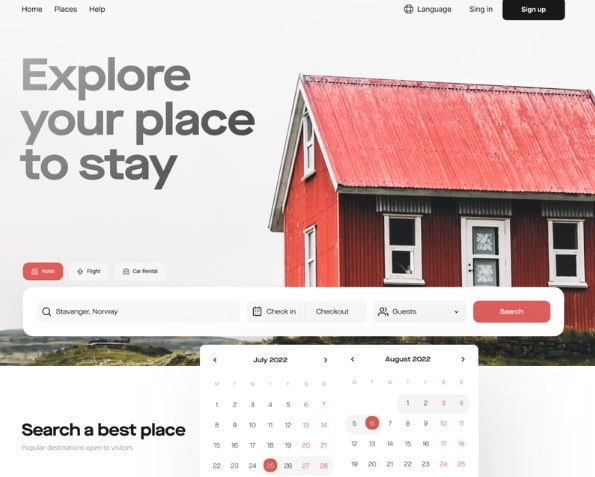

  

<h1 align="center">Exploring Airbnb Listings in the UK: Insights from Data Analysis</h1>

<h4 align="center">https://medium.com/@ashukla2k2/exploring-airbnb-listings-in-the-uk-insights-from-data-analysis-1a3df455187e
</h4>

---

 The project titled "Exploring Airbnb Listings in the UK: Insights from Data Analysis" is a data-driven analysis of Airbnb listings in the UK. The author utilizes Python libraries and data visualization techniques to extract insights and answer key questions about the Airbnb market in the UK. The analysis provides valuable information for businesses and hosts, such as the average price of listings by neighborhood, the most common room types and their percentages, and the relationship between the number of reviews and the availability of listings. The project emphasizes the importance of data-driven decision-making in the hospitality industry and offers valuable insights for stakeholders in the Airbnb market.
      

## 🧐 About 

The purpose of this project is to provide a data-driven analysis of Airbnb listings in the UK and offer valuable insights and implications for businesses and hosts in the hospitality industry. The project aims to answer key questions about the Airbnb market in the UK and highlight the importance of data-driven decision-making for stakeholders in the industry.

## 🏁 Getting Started 

Download the project files from the GitHub repository to your local machine. You can do this by clicking on the green "Code" button and selecting "Download ZIP", or by cloning the repository using Git.

Extract the downloaded ZIP file to a folder of your choice.

### Prerequisites

The prerequisites for the provided code are:

pandas library
pandas_profiling library
ydata_profiling library
sketch library
sklearn library with the SimpleImputer class
matplotlib library
Additionally, the code reads a csv file named 'abnbuklistings.csv' in the current working directory. Therefore, the csv file should be present in the same directory as the code.

### Installing

1. Clone the repository onto your local machine: git clone https://github.com/your-username/your-repo.git

2. Navigate into the project directory: cd your-repo

3. Create a virtual environment: python3 -m venv env

4. Activate the virtual environment: source env/bin/activate

5. Install the required packages: pip install -r requirements.txt

6. Open the main.ipynb in your CLI or Jupyter Notebook and explore the code :)

